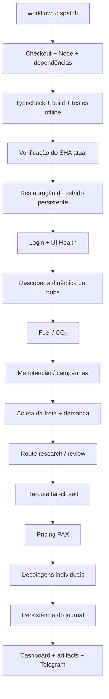

# ✈️ Airline Manager 4 Automation

[](https://github.com/andreypiekas/Airline-Manager-4-Automation/actions/workflows/validate.yml)
[](https://www.typescriptlang.org/)
[](https://playwright.dev/)
[](LICENSE)

Automação operacional para **Airline Manager 4 (AM4)** construída com **TypeScript, Playwright e GitHub Actions**.

O projeto automatiza rotinas repetitivas da companhia aérea com uma abordagem **fail-closed**: antes de executar uma ação no jogo, o bot tenta validar contexto, identidade, demanda, recursos e controles nativos da interface. Quando não há evidência suficiente, a operação é mantida em `HOLD` em vez de assumir dados ou repetir ações de forma incerta.

> [!WARNING]
> **Projeto não oficial e não afiliado ao Airline Manager 4.** Automação pode contrariar regras ou termos do jogo. O projeto reduz riscos operacionais do próprio bot, mas **não oferece garantia contra bloqueios, limitações ou banimento da conta**.

---

## Principais recursos

| Recurso | Estado |
| --- | --- |
| Login e leitura da frota | ✅ Produção |
| Descoberta automática de hubs/bases | ✅ Produção |
| Demand Manager | ✅ Produção |
| Decolagens individuais | ✅ Produção |
| Cobertura de rotas em qualquer aeroporto | ✅ Produção |
| Compra de Fuel com preço ao vivo | ✅ Produção |
| Compra de CO₂ | ✅ Produção |
| Manutenção, A-check e reparos | ✅ Produção |
| Campanhas de marketing | ✅ Produção |
| Pricing automático PAX | ✅ Produção |
| Pesquisa de rotas | ✅ Leitura |
| Revisão de rota no retorno/diária | ✅ Produção |
| Reroute automático | 🛡️ Fail-closed |
| Histórico persistente por aeronave | ✅ Produção |
| Threshold adaptativo de demanda | ✅ Produção |
| Dashboard no GitHub Actions | ✅ Produção |
| Notificações via Telegram | ✅ Produção |
| Compra automática de aeronaves | ❌ Fora do escopo |

O estado técnico detalhado está em [docs/IMPLEMENTATION_STATUS.md](docs/IMPLEMENTATION_STATUS.md).

---

## Como o bot trabalha

O bot não usa uma lista fixa de aeroportos para decidir quais aeronaves podem decolar.

### Decolagens em qualquer aeroporto

Para uma **rota já existente**, o executor é deliberadamente **base-agnostic**.

Isso significa que uma aeronave pronta pode ser processada independentemente do aeroporto atual, desde que os demais requisitos sejam confirmados:

- aeronave e rota identificadas de forma única;
- estado realmente pronto para decolagem;
- demanda recente e suficiente;
- capacidade e layout consistentes;
- botão nativo de `Depart` validado;
- estoque de Fuel compatível quando houver evidência disponível;
- ausência de quarentena operacional;
- orçamento de tempo suficiente para concluir e confirmar a ação.

As bases/hubs da companhia são relevantes para funções que realmente dependem de uma **origem operacional**, como revisão de rota e reroute. Elas **não limitam o despacho normal das rotas existentes**.

### Descoberta dinâmica de hubs

Em cada execução autenticada, o bot pode consultar a interface nativa do AM4 em modo de leitura e descobrir os hubs pertencentes à companhia.

Os IDs observados são cruzados com o catálogo local de aeroportos. A lista live só é usada quando pode ser resolvida de forma consistente.

`AIRLINE_BASES_JSON` existe apenas como **fallback conservador**.

Assim, uma nova base pode ser reconhecida automaticamente sem precisar alterar o código do executor de decolagem.

---

## Demand Manager

Antes de autorizar uma decolagem, o Demand Manager avalia a capacidade disponível e a demanda restante.

Entre os controles estão:

- demanda por classe `Y / J / F`;
- capacidade da aeronave;
- idade da observação;
- compartilhamento conservador de demanda entre aeronaves;
- threshold mínimo configurado;
- threshold adaptativo baseado em histórico verificado;
- identidade única da rota e da aeronave.

Configuração padrão:

```text
MIN_DEMAND_PERCENTAGE=80
DEMAND_THRESHOLD_MODE=aggregate
DEMAND_POOL_SCOPE=airport-pair
DEMAND_MAX_AGE_SECONDS=300
```

O threshold adaptativo pode elevar o limite quando o histórico fornece evidência suficiente. Ele não reduz o piso configurado com dados fracos ou incompletos.

---

## Pricing automático

O módulo de pricing parte do **Auto Price nativo do AM4** e aplica:

```text
Y = Auto Price × 1.10
J = Auto Price × 1.08
F = Auto Price × 1.06
```

O valor final é normalizado para múltiplos de 10.

O fluxo exige:

1. leitura do Auto Price;
2. cálculo do alvo;
3. validação do contexto da rota;
4. `Save` somente quando autorizado;
5. releitura da tarifa após o salvamento;
6. confirmação explícita do resultado.

Uma alteração cujo resultado fique incerto não é repetida automaticamente.

---

## Route Review e Reroute

A revisão de rota pode acontecer:

- após um retorno confirmado à base operacional; ou
- uma vez ao dia quando a aeronave é observada em solo na própria base.

As decisões são classificadas como:

- **KEEP** — manter a rota atual;
- **HOLD** — evidência insuficiente ou cenário não seguro para alteração;
- **REROUTE** — existe candidata superior e todos os gates obrigatórios foram satisfeitos.

Um reroute real só pode ocorrer quando a comparação é fresca e suficientemente completa, incluindo os controles internos `comparisonReady` e `mutationAuthorized`.

O bot não trata uma lista parcial de sugestões como prova da melhor rota global.

---

## Fuel e CO₂

O módulo de suprimentos usa o **preço observado ao vivo na interface**.

Exemplo de configuração:

```text
MAX_FUEL_PRICE=550
MAX_CO2_PRICE=120
MIN_CASH_RESERVE=0
```

O bot verifica preço, capacidade disponível, limites configurados e contexto antes da compra.

Após uma tentativa, estoque e resultado financeiro são relidos. Resultado inconclusivo entra em quarentena e não é repetido automaticamente.

---

## Segurança operacional

A arquitetura foi construída em torno de alguns princípios:

1. **Fail-closed** — falta de evidência significa não executar.
2. **Sem retry após mutação incerta** — uma ação que pode ter sido executada não é clicada novamente às cegas.
3. **Confirmação pós-operação** — departures, pricing e supplies precisam de evidência posterior.
4. **Estado persistente** — histórico e quarentenas sobrevivem aos runners efêmeros do GitHub Actions.
5. **Proteção contra rerun** — produção real rejeita reruns do mesmo GitHub Actions run.
6. **Proteção contra código obsoleto** — o SHA é conferido antes da fase autenticada.
7. **UI nativa validada** — controles precisam corresponder ao contexto esperado antes de um clique.
8. **Dados ausentes não viram zero** — valores econômicos ou operacionais desconhecidos permanecem desconhecidos.
9. **Limites por execução** — mutations são limitadas para reduzir impacto de comportamento inesperado.
10. **Orçamento de tempo** — nenhuma fase crítica começa quando não há janela suficiente para concluí-la com segurança.

---

## Fluxo de execução



O workflow principal é:

```text
.github/workflows/playwright.yml
```

Execuções simultâneas são serializadas para evitar duas automações atuando sobre a mesma companhia ao mesmo tempo.

---

## Instalação

### Requisitos

- Node.js 22+
- npm
- Chromium compatível com Playwright
- ambiente suportado pelo Playwright
- interface do Airline Manager 4 em **inglês**

### Criar seu fork

Para usar o bot na sua própria conta, faça primeiro um **fork** deste repositório no GitHub. Na criação do fork, selecione **Copy the DEFAULT branch only**; o workflow criará o estado persistente próprio na primeira execução.

Depois, se quiser trabalhar localmente, clone **o seu fork**:

```bash
git clone https://github.com/SEU_USUARIO/Airline-Manager-4-Automation.git
cd Airline-Manager-4-Automation

npm ci
npx playwright install --with-deps chromium
```

Secrets e Variables devem ser configurados no seu fork.

### Validar localmente

```bash
npm run typecheck
npm run build:state
node scripts/company-dashboard.cjs --self-test
npm test
```

Essas validações são offline e não precisam acessar a conta do jogo.

---

## Configuração no GitHub

> **Guia de instalação completo:** [GitHub Actions + Secrets + Variables + cron-job.org](docs/GITHUB_AND_CRON_SETUP.md)

Depois de criar o fork, habilite **Actions** nele e abra:

**Seu fork → Settings → Secrets and variables → Actions**

### Secrets obrigatórios

| Secret | Descrição |
| --- | --- |
| `EMAIL` | E-mail da conta utilizada no AM4 |
| `PASSWORD` | Senha da conta |

### Telegram opcional

| Secret | Descrição |
| --- | --- |
| `TELEGRAM_BOT_TOKEN` | Token do bot |
| `TELEGRAM_CHAT_ID` | ID da conversa ou grupo de destino |

> `TELEGRAM_CHAT_ID` deve ser o ID da conversa, não o ID do próprio bot.

### Variables recomendadas

```text
RETURN_JOURNAL_SCOPE=am4-prod

MAX_INDIVIDUAL_DEPARTURES=20

MIN_DEMAND_PERCENTAGE=80
DEMAND_THRESHOLD_MODE=aggregate
DEMAND_POOL_SCOPE=airport-pair
DEMAND_MAX_AGE_SECONDS=300

MAX_FUEL_PRICE=550
MAX_CO2_PRICE=120
MIN_CASH_RESERVE=0

ENABLE_ROUTE_RESEARCH=true
ROUTE_RESEARCH_MAX_AIRCRAFT=3
ROUTE_RESEARCH_MAX_SUGGESTIONS=5

ENABLE_ROUTE_OPTIMIZER=true
ENABLE_ROUTE_EXECUTION=true
ROUTE_MAX_REROUTES_PER_RUN=1

ENABLE_TICKET_PRICING=true
ENABLE_TICKET_PRICING_EXECUTION=true
TICKET_PRICING_MAX_ADJUSTMENTS_PER_RUN=5
```

A referência completa está em [docs/CONFIGURATION.md](docs/CONFIGURATION.md).

---

## Execução

O workflow suporta dois modos principais.

### Production

Executa as operações autorizadas pelos módulos e gates de segurança.

```text
departure_mode=production
```

### Simulation

Mantém as principais mutações desativadas para inspeção controlada.

```text
departure_mode=simulation
```

> Uma run marcada como `success` significa que o workflow terminou de forma consistente. Não significa necessariamente que houve decolagens, compras, alterações de preço ou reroutes. Uma decisão de `HOLD` pode ser exatamente o resultado esperado.

---

## Agendamento externo

O workflow operacional usa `workflow_dispatch` e não depende de um schedule interno.

Isso permite acionamento manual ou por um serviço externo, como **cron-job.org**.

Endpoint:

```text
POST https://api.github.com/repos/SEU_USUARIO/Airline-Manager-4-Automation/actions/workflows/playwright.yml/dispatches
```

Body:

```json
{
  "ref": "main"
}
```

Para automação externa, use um **Fine-grained Personal Access Token** limitado ao repositório e com a permissão mínima necessária para executar GitHub Actions.

Veja [docs/GITHUB_AND_CRON_SETUP.md](docs/GITHUB_AND_CRON_SETUP.md) para o passo a passo completo do GitHub e cron-job.org, ou [AUTOMACAO.md](AUTOMACAO.md) para a operação diária.

---

## Estado persistente

O bot mantém histórico operacional separado do código.

Branch de runtime:

```text
am4-runtime-state
```

Em um fork novo ela é criada automaticamente com um journal vazio; não é necessário copiar a branch de runtime do repositório original.

O journal registra, entre outras evidências:

- decolagens confirmadas;
- passageiros observados após a partida;
- retornos/chegadas;
- revisões de rota;
- histórico de demanda;
- Flight History observado;
- HOLDs;
- mutations incertas;
- informações necessárias aos thresholds adaptativos.

Não é recomendado apagar quarentenas apenas para liberar uma nova tentativa.

---

## Dashboard e relatórios

Cada execução pode produzir:

- **GitHub Step Summary** com visão executiva;
- `demand-report` com relatórios JSON/Markdown;
- `playwright-report` com evidências técnicas;
- estados operacionais consolidados;
- relatórios de pricing, rotas e supplies;
- resumo opcional via Telegram.

O dashboard prioriza o que precisa de atenção em vez de repetir toda a frota em cada execução.

---

## Estrutura do projeto

```text
.github/workflows/   GitHub Actions
data/reference/      catálogo e referências estáticas
demand/              demanda e decolagens
optimization/        rotas, economia, histórico e journal
pricing/             pricing PAX
supplies/            Fuel e CO₂
scripts/             dashboard, estado e notificações
tests/live/          probes controlados
tests/unit/          suíte offline
utils/               login e módulos operacionais
docs/                documentação técnica
```

---

## Troubleshooting

**A run ficou verde, mas nenhum avião decolou**

Isso pode ser normal. Consulte o Summary e `execution-report.md`. Demanda insuficiente, quarentena, falta de evidência ou limites operacionais podem resultar em `HOLD`.

**Fuel não foi comprado**

Verifique preço ao vivo, teto configurado, capacidade disponível, caixa mínimo e possíveis quarentenas.

**Reroute não ocorreu**

A comparação provavelmente não atingiu todos os gates necessários. O executor prefere manter a rota a executar uma troca sem evidência suficiente.

**Telegram retorna erro 403**

Confirme que `TELEGRAM_CHAT_ID` corresponde à conversa/grupo e que o bot já recebeu uma mensagem ou foi iniciado no destino.

**Uma run antiga não acessou o jogo**

O guard de SHA pode ter identificado que o código no `main` mudou enquanto aquela execução aguardava na fila.

---

## Documentação

| Documento | Conteúdo |
| --- | --- |
| [docs/README.md](docs/README.md) | Índice técnico |
| [docs/GITHUB_AND_CRON_SETUP.md](docs/GITHUB_AND_CRON_SETUP.md) | Configuração completa do GitHub e cron-job.org |
| [docs/CONFIGURATION.md](docs/CONFIGURATION.md) | Secrets, Variables e limites |
| [docs/DEMAND_MANAGER.md](docs/DEMAND_MANAGER.md) | Regras de demanda |
| [docs/PRODUCTION_DEPARTURES.md](docs/PRODUCTION_DEPARTURES.md) | Executor de decolagens |
| [docs/ROUTES_AND_PRICING.md](docs/ROUTES_AND_PRICING.md) | Route review, reroute e pricing |
| [docs/SUPPLIES.md](docs/SUPPLIES.md) | Fuel e CO₂ |
| [docs/RESERVATIONS_AND_COSTS.md](docs/RESERVATIONS_AND_COSTS.md) | Reservas e custos |
| [docs/REPORTS_AND_TELEGRAM.md](docs/REPORTS_AND_TELEGRAM.md) | Dashboard, artifacts e Telegram |
| [docs/IMPLEMENTATION_STATUS.md](docs/IMPLEMENTATION_STATUS.md) | Estado técnico atual |
| [AUTOMACAO.md](AUTOMACAO.md) | Guia operacional |
| [docs/archive/](docs/archive/) | Histórico de desenvolvimento |

---

## Contribuições

Issues e pull requests são bem-vindos, especialmente para:

- melhorar compatibilidade com alterações da UI do AM4;
- ampliar testes de parsing e segurança;
- melhorar observabilidade e relatórios;
- tornar a documentação mais clara;
- adicionar novos módulos sem enfraquecer os gates existentes.

Mudanças operacionais devem manter o comportamento **fail-closed**.

---

## Licença

Distribuído sob a licença **MIT**.

Os avisos e atribuições herdados do projeto de origem permanecem preservados em [LICENSE](LICENSE).

---

### Autor

**Andrey Gheno Piekas**

Projeto desenvolvido para experimentação, automação e estudo de operações no Airline Manager 4.
